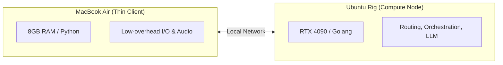
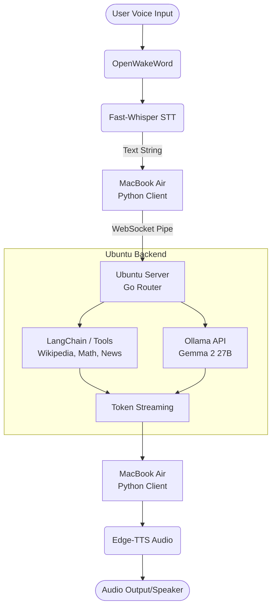

# Project Jarvis: High-Performance AI Knowledge Agent
An ultra-low-latency, stable, and child-friendly AI Knowledge Agent designed to run seamlessly across a local network. The system utilizes a lightweight client-server architecture, offloading heavy orchestration and LLM reasoning to a dedicated Linux GPU server while maintaining low-overhead hardware input/output (I/O) on a legacy client machine.

## Project Purpose & Goals
The objective of this project is to build a highly responsive, stable, and autonomous "Jarvis-like" companion for interactive learning. 

**Educational Companion**: Provides instant access to encyclopedic knowledge, Wikipedia, scientific computation, and real-time news in a safe, child-friendly format.

**Zero-Throttling Architecture**: Replaces fragile, third-party frameworks with a custom pipeline, eliminating memory bottlenecks and connection timeouts.

**Blazing Fast Performance**: Leverages local network streaming and hardware-native execution to achieve a sub-second Time-to-First-Token (TTFT) response layer.   

**Autonomous Reliability**: Implements a server-side automation scheduler that functions independently of client machine sleep states or network drops.

## Hardware Architecture & Responsibilities
The system splits workloads based on hardware strengths, transforming the legacy client into a streamlined thin-client terminal.





### 1. Client Node (MacBook Air)
*   **Wake Word Detection**: Runs `openwakeword` locally to continuously listen for activation.
*   **Speech-to-Text (STT)**: Uses `fast-whisper` locally to translate captured audio to text, keeping network transmission payloads lightweight.
*   **Text-to-Speech (TTS)**: Runs `edge-tts` to convert returned text streams into real-time audio playback.
*   **Peripherals**: Manages webcam frame capturing, keyboard parsing, and display rendering.

### 2. Compute Node (Ubuntu Server)
*   **Core Logic Router**: A native **Golang** binary managing high-concurrency WebSocket channels, stream multiplexing, and task routing.
*   **Inference Brain**: Hosts `Ollama` running a 27B/31B parameter model (`gemma4:31b`) completely in the 24GB VRAM of an RTX 4090.
*   **Vision Engine**: Evaluates incoming camera frames using locally hosted vision-language models.
*   **Background Cron Engine**: Manages the persistent 6:00 AM automation loop for scraping, distilling, and caching daily news bulletins.


## Detailed Component Pipeline





---

## Key Design Principles

### 1. Edge-Inference Hybridization
By executing Speech-to-Text (`fast-whisper`) locally on the MacBook Air, the system only passes small raw strings over the local network instead of continuous raw PCM audio bytes. This completely removes network-induced audio dropouts and serialization overhead.

### 2. High-Concurrency Go Router
The orchestration engine on Ubuntu is written in Go. Go handles streaming I/O via lightweight *goroutines*, allowing it to maintain a stable, non-blocking connection with the client while concurrently handling heavy LLM inference pipelines, multi-tool executions, and background routines.

### 3. Server-Controlled Scheduling (The 6 AM Briefing)
To combat aggressive macOS power management and "App Nap" states, the cron engine runs natively on the Ubuntu server. At 6:00 AM, the server fetches, summarizes, and formats the daily briefing into memory. The next time the client initiates a handshake or wake trigger, the briefing is pushed immediately without relying on the Mac to wake up prematurely.

---

## Repository Directory Structure

```text
├── client/                 # Python-based Thin Client for MacBook Air
│   ├── main.py             # Event loop managing WakeWord -> STT -> WS -> TTS
│   ├── requirements.txt    # Python dependencies (openwakeword, fast-whisper, edge-tts)
│   ├── .env.example        # Configuration template
│   ├── run.sh              # Quick start script for client
│   └── jarvis.service      # Systemd service file for auto-start
│
├── server/                 # Golang-based Compute Engine for Ubuntu
│   ├── main.go             # Entry point, WebSocket upgrader, and server routing
│   ├── ollama.go           # Native bindings/API client calls to Gemma 27B
│   ├── scheduler.go        # Chrono routines for the 6:00 AM news pipeline
│   ├── server_handlers.go  # WebSocket connection and message handlers
│   ├── .env.example        # Configuration template
│   ├── run.sh              # Quick start script for server
│   ├── go.mod              # Go module definition and dependencies
│   └── go.sum              # Go dependency checksums
│
├── setup.sh                # Automated setup script for client, server, or both
├── README.md               # Architecture documentation
├── DEPLOYMENT.md           # Deployment guide
└── TEST_PLAN.md            # Testing strategy
```

## Quick Start

1. **Clone and setup:**
   ```bash
   ./setup.sh
   ```
    Use `./setup.sh --client` on the thin client machine or `./setup.sh --server` on the compute node.

2. **Configure:**
   - Edit `server/.env` with your Ollama settings
   - Edit `client/.env` with your server IP address

3. **Run (development):**
   ```bash
   # Terminal 1 - Start server
   cd server && ./run.sh
   
   # Terminal 2 - Start client
   cd client && ./run.sh
   ```

For production deployment, see [DEPLOYMENT.md](DEPLOYMENT.md).

